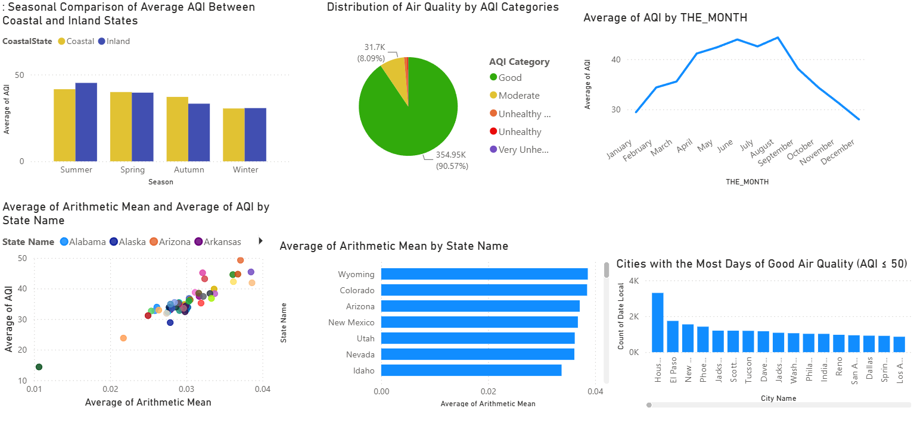

# 🌍 Air Quality Analysis Dashboard using Power BI

## 📖 Overview

This project presents an interactive Power BI dashboard that analyzes air quality patterns across the United States during 2020 using the Air Quality Index (AQI). The dashboard provides insights into seasonal trends, monthly air quality variations, pollutant concentration, and geographic differences among states and cities.

---

## 🎯 Project Objectives

The dashboard answers the following business questions:

- How does average air quality vary seasonally between coastal and inland states?
- During which months did air quality reach its highest and lowest levels?
- How were ozone air quality measurements distributed across AQI categories?
- Which U.S. states recorded the highest average pollutant concentrations?
- Is there a relationship between pollutant concentration and AQI?
- Which cities experienced the greatest number of Good Air Quality days (AQI ≤ 50)?

---

## 📊 Dashboard Overview

The dashboard includes:

- **Seasonal Comparison** of Average AQI between Coastal and Inland States
- **Monthly AQI Trend** throughout 2020
- **Distribution of AQI Categories**
- **Average Pollutant Concentration by State**
- **Correlation between Arithmetic Mean and AQI**
- **Cities with the Highest Number of Good Air Quality Days**

---

## 🛠 Tools & Technologies

- Power BI
- Power Query
- DAX
- Data Modeling

---

## 📂 Dataset

The analysis uses official U.S. Air Quality monitoring data collected during **2020** from more than **4,000 monitoring stations**.

Main attributes include:

- Air Quality Index (AQI)
- Ozone Measurements
- Arithmetic Mean
- State
- City
- Month
- Season
- AQI Category

---

## 📈 Key Findings

- Inland states generally experienced higher AQI values during summer compared to coastal states.
- Average AQI increased during spring, peaked in September, and declined toward winter.
- More than 90% of observations were classified as **Good** air quality.
- Wyoming recorded the highest average pollutant concentration, followed by Colorado and Arizona.
- A strong positive relationship exists between pollutant concentration and AQI.
- Houston recorded the highest number of Good Air Quality days (AQI ≤ 50).

---

## 📷 Dashboard Preview

